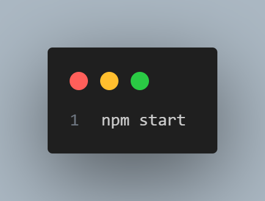

# Uprodit Search Engine

## Introduction
[Uprodit Search Engine](https://github.com/houssemsalah/uprodit-search-engine) is a web application developed using React for searching and displaying results. This repository contains the source code and necessary files to build and run the application locally.

## Prerequisites
- Node.js (v12 or higher)
- npm package manager
- Docker Desktop (if you prefer running the application in a Docker container)

## Local Development

### 1. Clone the Repository

 git clone https://github.com/houssemsalah/uprodit-search-engine.git
 

### 2. Install Dependencies

cd uprodit-search-engine

npm install

### 3. Start the Development Server

npm start

<!-- This will start the development server and the application will be accessible at http://localhost:3000 in your web browser. -->

### 4. Building the Application

npm run build

<!-- This command will create a production-ready build of the application in the build directory. -->

### 5. Running in a Docker Container

   #### Build the Docker Image

docker build -t uprodit-search-engine .

   #### Run the Docker Container

docker run -p 3000:3000 uprodit-search-engine

<!-- The application will be accessible at http://localhost in your web browser. -->

### 6. Screenshots

